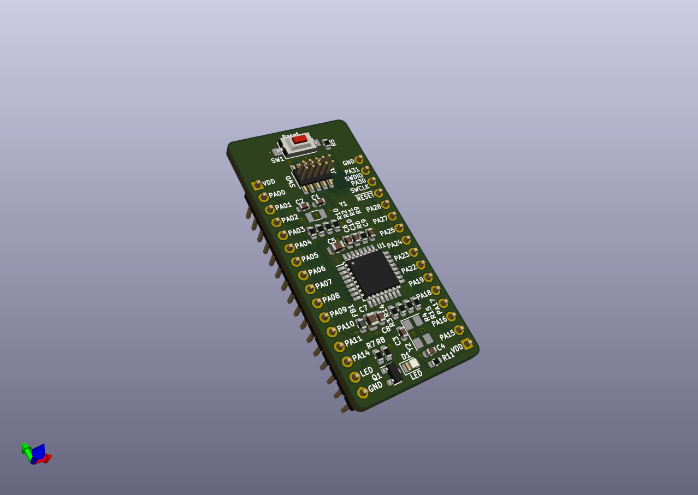

# ATSAMD2x (SAM D2x) Breakout Board (Rev. A)

Small MCU board designed for the [SAM D20](http://ww1.microchip.com/downloads/en/DeviceDoc/SAM_D20_%20Family_Datasheet_DS60001504C.pdf) and [SAM D21](http://ww1.microchip.com/downloads/en/DeviceDoc/SAM_D21_DA1_Family_DataSheet_DS40001882F.pdf) ARM Cortex-M0+ microcontrollers from Microchip

## Features

- minimal subset of components, no power regulation etc.
- optional external main and real-time crystals - if not used, their GPIO pins can be connected to the user header by soldering relevant 0R resistors (see schematic)
- one buffered user LED, connected to the header - no reserved GPIO
- reset button
- standard 0.05" pitch SWD programming header, SWD signals also present on the pin headers

Designed in KiCad 5.1.6

Schematic: [PDF](docs/atsamd20-breakout.pdf)

License: [CC BY-SA 4.0](https://creativecommons.org/licenses/by-sa/4.0/)
